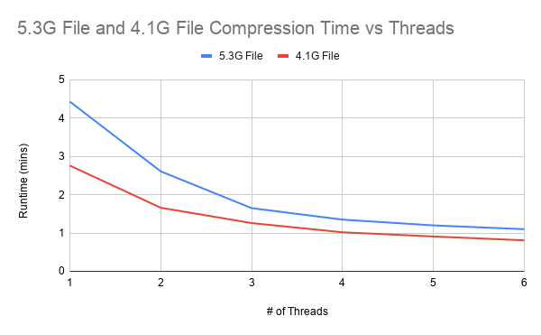

# Threaded File Compression

This is a very basic program that can compress and decompress a file with a configurable amount of threads 4096 bytes at a time. 

## Code Structure
`deflate_file()` - The main function for compressing a given file.  It works by reading 4096 bytes from the input file and it then assigns it to a worker thread.  Then the main thread will query each worker thread to see if there is any compressed data to be dumped, making the output is in the correct order.  This could certainly be optimized to write
the ouput to a buffer to ensure the workers don't lay idle for long.  

`compression()` - Simple wrapper function for `def()` as a starting point for each worker thread.

`def()` - Handles the compression of each 4096 chunk.  Based on the code shown on the zlib website.  It just sets up a zlib stream and sends in the entire chunk for compression.

`inflate_file()` - Reads the compressed file and writes the decompressed data to the filename + '.uc'.  Note that the if statement `if(ret == Z_STREAM_END)` is what allows this
function to decompress the enetire file without having to worry about the compressed chunk boundaries.

## How to Build
1. Clone this repo
2. If you have make installed navigate to the zlib directory and run `make` followed by `make install` to build zlib
3. Go back to the src directory and run `gcc main.c zlib/libz.a -lpthread -Wall`
4. If you don't have make installed you can run `gcc main.c -lpthread -Wall -lz` (assuming you have zlib installed)

**Note** You can also try adding `-lz` to gcc command if you would prefer to avoid building zlib. Here I'm exporting zlib as a static library file `.a` extension for Unix based systems (for archive).  This will likely have issues on non-Linux based systems.

## Running
To run the program you need to specify whether you want to compress or decompress a file, this is specified with -c and -d respectively.

### For Compression
`./a.out -c file_to_compress #_of_threads` - This will output the compressed data to file_to_compress.zl

### For Decompression
`./a.out -d file_to_decompress.zl` This will output the decompressed data to file_to_decompress.zl.uc.  This is intended for use of quickly verifying that the compression engine
is outputting valid data.

## Results
All tests were run on Intel Xeon v2 processors each with 8 physical cores (2 chips on board).

| # File              | 1 Thread      | 1 Threads    | 1 Threads    | 1 Threads    | 1 Threads    | 1 Threads    |
| -------------       | ------------- | ------------- | ------------- | ------------- | ------------- | ------------- |
| 5.3G Text & Numbers | 4:26 Minutes  | 2:37 Minutes | 1:39 Minutes | 1:21 Minutes | 1:12 Minutes | 1:06 Minutes |
| 4.1G Text           | 2:46 Minutes | 1:40 Minutes | 1:13 Minutes | 1:01 Minutes | 55 Seconds | 49 Seconds |

## Conclusion
As we would expect, increasing the # of threads decreases the runtime of the compression engine.  The reason why the runtime decreases begin to taper off fast is because
there is only a single thread responsible for reading and writing the outout compressed data.  Addionally the program isn't omptimized in the way of keeping all workers 
active at all times (they must lay idle while they wait for their turn to dump their data).  It should be noted that although faster than gzip, there is a slight hit
to the compression ratio due to the relatively low block size (less matches).
